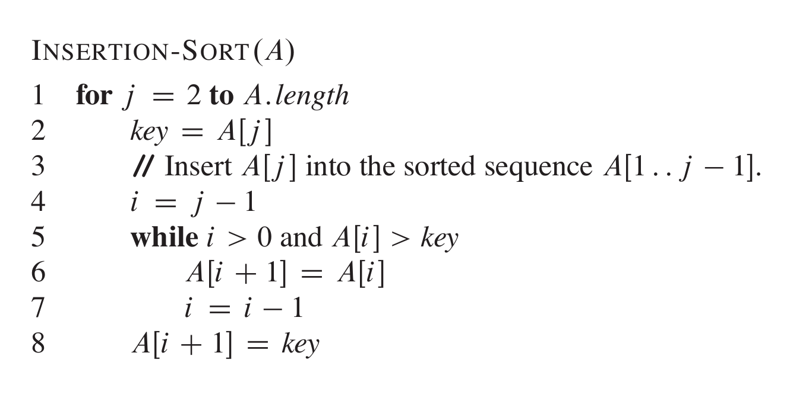
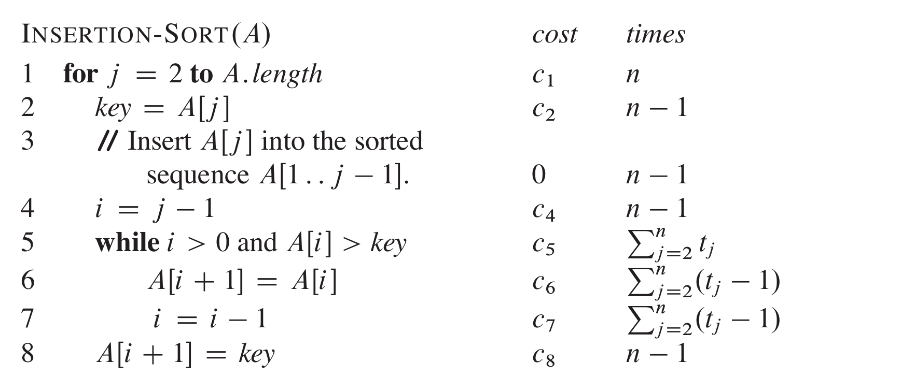
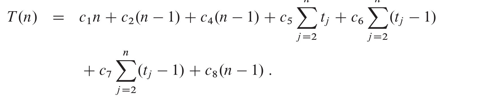
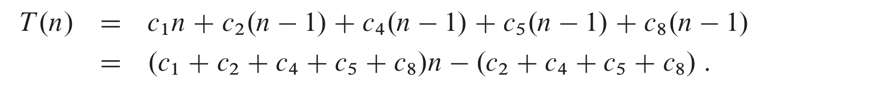
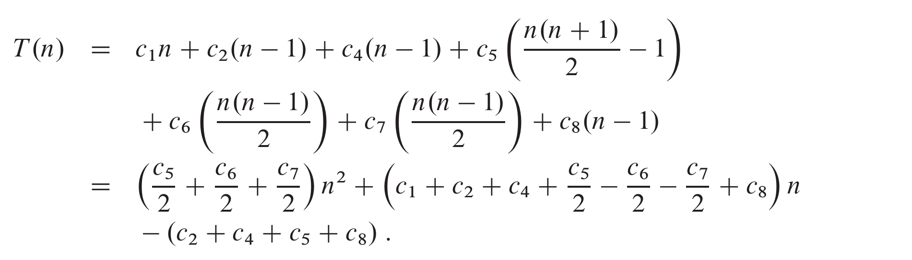

# Insertion-sort 

 >**Properties of Insertion sort :** 
 >> IN-PLACE
 >> INCREMENTAL  

Suitable for sorting a small number of elements ,  works by maintaing two parts of the input , one sorted at ny moment and another similar as they were in the input array . and for each of the elements in the unsorted it finds the correct sorted place in sorted part and palces the element there ,  in a way increasing the size of the sorted part till the whole input is sorted 

## PSUEDO-CODE  :

### Explanantion 

As mentioned the Insertion Sort works , by spliting the input as well as mainiting  it in two parts , during any moment of iteration , J   

- left : A[1:j -1] : the elements belonging to the original input A from 1 to j -1 but in sorted order 
- right : A[j:N] : the elements belonging to the original input A from J to N as  in the same order as they were in the input , i.e unsorted 

and during the iteration J, it tries to place A[j] in the correct sorted  palce in A[1:j] ,i.e so after the  iteration J , i.e before iteration J+1 , the Array A[1:j] is osrted and A[j+!:N] is not. 

>>**LOOP INVARIANT OF INSERTION SORT**   
At the start of any iteration j of the Loop, the subarray A[1...J-1]  consists of the elements originally un A[1..j-1] but in sorted order 

**Initaialization:**  before starting the Loop , j = 2, the subarray A[1..j-1] is A[1..1] which is sorted and only sonsisits fo elements of A from 1 to j -1 , so the invariant is true 

**Maintainenece:** In lines 4-7, for each j  , it iterates all elements in the left part i.e A[1..j-1] and shifts them one place to right , till an element is found  which is lesser than or equal to the element and in the line and in line 8 it places the   element A[j]  (this palce will be vaccant as all elements till here has been  shifted to right) 
>**so now all the  elements in the left of the selectd ar elss than or equal  A[j] and all in right till j are greater than A[j] **   

so if this repeated  for all elements ,  the above mentioned property will be true for all , which will amke the array sorted. 

and for the LOOP INVARIANT  , it is also true maintaindence as beofre any loop , A[1..j-1] is  sorted and after the iteration j completes all  the elements in A[1..J] is sorted and only consits iof the elements  from A[1..j+1] , whihc will make the loop invairant true for iteration j+1 and so on    

**Termination:**  The loop terminaltes when j > A.length ,.i.e j = n+1 , but after iteration n , the loop variant was true as  prooved in maintainence , hence  nefore termination , the A[1..n] is sorted consisting of all elements from A[1..n] only.  whihc is nothing but sorted input A . hence the input is sorted before the termination of  insertion sort 

## Running Time of Insertion Sort T(n)

let the column cost be  the time taken at the hardware leve to execute that line of command , and column times represent the no.of times this line is executed durring the lifetime of the  execution 

Now ,  the best i.e the lowest time will tabe taken when the inputed is already sorted ,  the inner loop in line 4-7 will be executed  once as the  the lement at j-1 will be A[j-1] <= A[j] w, hence the , lien 4 will be executed a total of n-1 and line  6, 7 wont be execute , because of the loop condition , hence ,  they will be executed 0 times each . 

so **$T(N) = an+ b$ ,  which is Linear** 
so,    

**best case time of Insertion Sort is : Linear**

but  when the input is reverse sorted, wew will get the worst running time of the algorithm , instead of before no the   lines 4 to 7 will run  (n-1) + (n-2) + .. 1 times 
which is 

in this **$T(N) = an^2+ bn+ 2$ , which is quadratic** 

