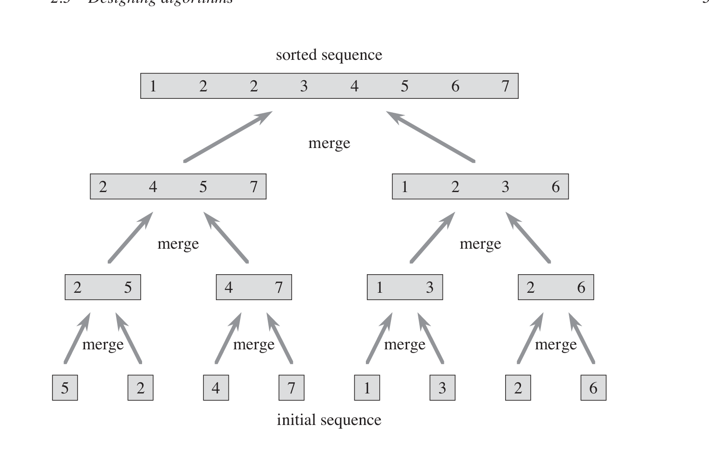
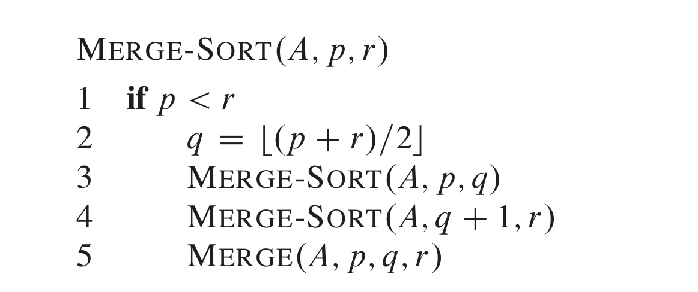
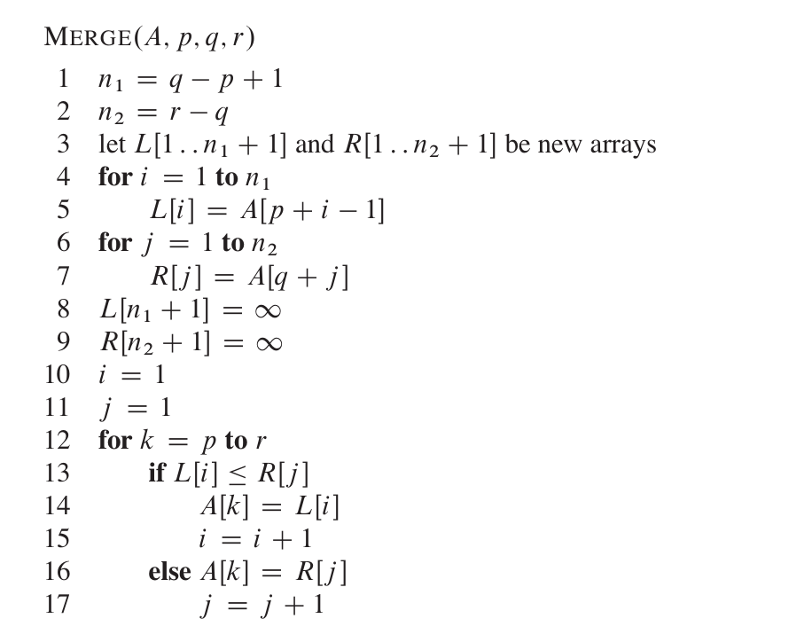

# Merge - Sort 

>**Properties of Merge-Sort**
   

Merge Sort works by  splitting the input into two equal size and  then sorts them, once the  shorter inputs are sorted, they are merged to the give the whole input in sorted order . 

## Psuedo Code 

### Explanantion 

