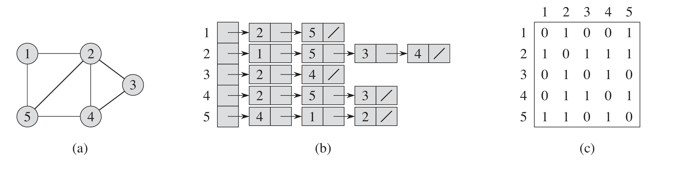
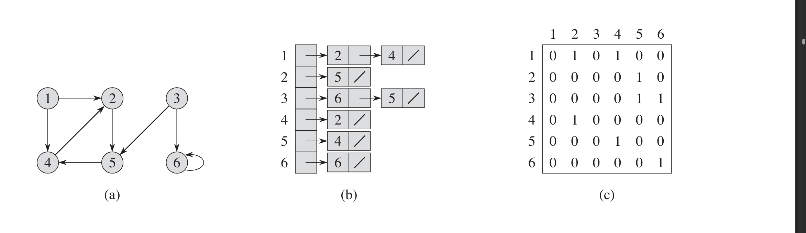

# Representations of Graphs

There are two ways to represent a grpah G = (V,E)

> Adjancency List  : useful when the graph is sparse , i.e. $|E| << |V|^2$
> Adjacency Matrix : usefull when the graph is dense , i.e. $|E| \sim |v|^2$   

for undoirected Graph :

fig a : graph, (b) is the Adjacency List , (c) is the Adjacency Matrix 

for undoirected Graph :

fig a : graph, (b) is the Adjacency List , (c) is the Adjacency Matrix

## Adjanceny List 

The adjancency List of a Graph G = (V,E) consists of a array  of  $|V|$ lists , one for each vertex , where each list $Adj[u]$  is the list of all the  vertices $v$ that are adjacent to u , i.e. $(u,v) \in E $

**$Adjacency\;list\;Adj\;of\;Graph(G=(V,E))\;= \left[\left\{v \mid (u,v) \in E \right\}\;\right]\forall \;u \;\in V $**

So ,the  sum of lenghts  of  all list of adjanceny list of a     
**Undirected Graph = $2\times|E|$**   
**Directed Graph = $|E|$**   

> - **Advantages of Adjacency List :**
>> - MEMORY REQUIRED :  $\Theta(|V|+ |E|)$
> - **Disadantages  of Adjacency List :** 
>> - There is no quicker way to check for existence of a edge (u,v) in the graph 

A weighted Graph can also be represented by a adjacency list  by just storing the weight of the edge (u,v), w  along with v in $Adj[u]$

## Adjacency Matrix

The Adjacency matrix,A for a graph $G = (V,E)$ is $|V| \times |V|$ matrix where 

$a_{ij} =
\begin{cases}
1 &  \text{if} (i,j) \mid E \\
0 &  \text{otherwise} 
\end{cases}$

It is assumed that the vertices are given some unique numbers from 1 to |V| , and for each of these numbered vertices u , another list is made of size |V| again for each vertex v , where  the entry is made to be 1 if $(u,v) \in E$

For a weighted graph G = (V,E) with weight function $w(u,v)$ the afjacency matrix can be made by 

$a_{ij} =
\begin{cases}
w(u,v) &  \text{if} (i,j) \mid E \\
NIL &  \text{otherwise} 
\end{cases}$

where NIL can be any appropriate value , majorly 0 or $\infin$ are used 

> - **Advantages of Adjacency Matrix :**
>> - independent of  number of edgs in the graph 
>> - checks of edge existence is genrally $O(1)$
> - **Disadantages  of Adjacency Matrix :**
>> - MEMORY REQUIRED :  $\Theta(|V|^2)$   

in an  unweightedd graph , the adjacency martix of the graph is transpose of itself ,

$A = A^T$

as an edge (u,v) and (v,u) both represent  the same edge 

$$
f(x) = \begin{cases} 
    x^2 & \text{if } x \ge 0 \\
    -x & \text{if } x < 0 
\end{cases}
$$

